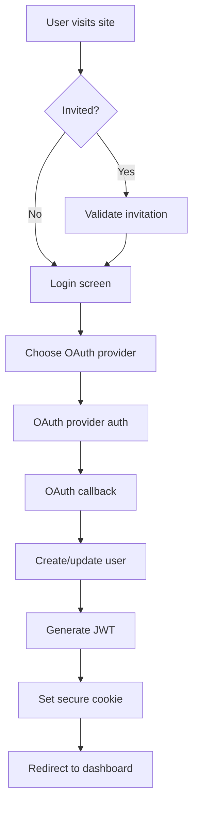

# Project Plan: Modular Frontend Authorization System

## Project Overview
Create a modular front-end authorization system that can be deployed to Vercel with Google and Microsoft OAuth integration, complete with email-based invitation system. The system will replicate the existing PGL freight analytics dashboard but add a secure authentication gate.

## Core Objective
**"Existing front-end with a clean authorization entry gate"**

## Technical Analysis

### Source Application Architecture
- **Framework**: Next.js 15.5.2 with App Router
- **UI Library**: React 19.1.0 + Radix UI components  
- **Styling**: Tailwind CSS v4
- **TypeScript**: Full type safety
- **Key Dependencies**: 
  - @tanstack/react-table for data tables
  - Recharts for visualizations
  - Weaviate client for semantic search
  - OpenAI client for AI features

### Target Authentication Requirements
- **OAuth Providers**: Google + Microsoft
- **Invitation System**: Email-specific invitation links
- **Parameterization**: Configurable for different deployments
- **Integration**: Seamless gate before dashboard access

## Detailed Implementation Plan

### Phase 1: Infrastructure Setup (Steps 1-8)
**Objective**: Establish foundation and copy existing codebase

#### Step 1: Create Base Project Structure
- **Action**: Initialize Next.js project structure
- **Deliverable**: Basic file structure with proper directories
- **Evidence**: Directory listing showing complete structure
- **Microstep**: 
  - Create `app/`, `components/`, `lib/`, `public/` directories
  - Copy `package.json` and install dependencies
  - Set up `next.config.ts`, `tailwind.config.js`, `tsconfig.json`

#### Step 2: Copy Core Frontend Components
- **Action**: Transfer all UI components and pages from source
- **Deliverable**: Fully functional dashboard (without auth)
- **Evidence**: 
  - File count match between source and target
  - Dashboard loads without errors
  - All components render correctly
- **Microstep**:
  - Copy `app/` directory structure
  - Copy `components/` with all UI components
  - Copy `lib/` utilities and helpers
  - Copy `public/` assets including images

#### Step 3: Environment Configuration
- **Action**: Set up environment variables for multi-deployment support
- **Deliverable**: Configurable environment system
- **Evidence**: Environment variables properly loaded and used
- **Microstep**:
  - Create `.env.local` template
  - Add deployment-specific variables
  - Add OAuth client IDs/secrets placeholders
  - Add database connection strings

#### Step 4: Database Schema Design for Auth
- **Action**: Design auth tables compatible with existing system
- **Deliverable**: Database schema for user management
- **Evidence**: SQL migration files and table structure
- **Microstep**:
  - Design `users` table (id, email, name, provider, created_at)
  - Design `invitations` table (id, email, token, used, expires_at)
  - Design `user_sessions` table for session management
  - Create migration scripts

#### Step 5: API Route Structure
- **Action**: Create API endpoints for authentication flow
- **Deliverable**: Complete API route structure
- **Evidence**: API routes return proper status codes
- **Microstep**:
  - `/api/auth/signin` - OAuth initiation
  - `/api/auth/callback` - OAuth callback handling
  - `/api/auth/session` - Session validation
  - `/api/invitations/create` - Create invitation
  - `/api/invitations/validate` - Validate invitation token

#### Step 6: OAuth Provider Configuration
- **Action**: Set up Google and Microsoft OAuth applications
- **Deliverable**: OAuth providers configured and tested
- **Evidence**: OAuth consent screens load correctly
- **Microstep**:
  - Create Google Cloud Console OAuth 2.0 client
  - Create Microsoft Azure AD application registration
  - Configure redirect URIs
  - Test OAuth flows manually

#### Step 7: JWT/Session Management System
- **Action**: Implement secure session management
- **Deliverable**: JWT token system with refresh logic
- **Evidence**: Tokens generate, validate, and refresh properly
- **Microstep**:
  - Implement JWT token generation with proper claims
  - Add JWT validation middleware
  - Create refresh token rotation
  - Add secure cookie handling

#### Step 8: Initial Testing Framework
- **Action**: Set up testing infrastructure
- **Deliverable**: Test suites for auth components
- **Evidence**: Tests run and pass
- **Microstep**:
  - Set up Jest and React Testing Library
  - Create auth flow integration tests
  - Add component unit tests
  - Set up E2E testing with Playwright

### Phase 2: Authentication Components (Steps 9-16)
**Objective**: Create modular authentication UI components

#### Step 9: Auth Layout Component
- **Action**: Create wrapper component for authentication screens
- **Deliverable**: Reusable auth layout with branding
- **Evidence**: Layout renders with proper styling
- **Microstep**:
  - Create `AuthLayout` component with logo placement
  - Add responsive design for mobile/desktop
  - Include loading states and error handling
  - Add accessibility attributes

#### Step 10: Login Screen Component
- **Action**: Build main authentication entry point
- **Deliverable**: Login screen with OAuth buttons
- **Evidence**: OAuth providers buttons work correctly
- **Microstep**:
  - Create `LoginScreen` with provider buttons
  - Add hover states and loading indicators
  - Implement proper error messaging
  - Add CSRF protection

#### Step 11: Invitation Validation Component
- **Action**: Component to handle invitation links
- **Deliverable**: Invitation validation screen
- **Evidence**: Valid/invalid invitations handled properly
- **Microstep**:
  - Create `InvitationValidation` component
  - Add invitation token parsing from URL
  - Implement expiration checking
  - Add invitation acceptance flow

#### Step 12: User Profile Component
- **Action**: Post-auth user information display
- **Deliverable**: User profile/account component
- **Evidence**: User data displays correctly
- **Microstep**:
  - Create `UserProfile` component
  - Add avatar/name display
  - Implement logout functionality
  - Add account settings options

#### Step 13: Admin Invitation Panel
- **Action**: Interface for sending invitations
- **Deliverable**: Admin panel for invitation management
- **Evidence**: Invitations can be created and sent
- **Microstep**:
  - Create `InvitationPanel` component
  - Add email input with validation
  - Implement bulk invitation sending
  - Add invitation status tracking

#### Step 14: Route Protection HOC
- **Action**: Higher-order component for route protection
- **Deliverable**: Reusable route protection logic
- **Evidence**: Unauthorized access redirects to login
- **Microstep**:
  - Create `withAuth` HOC
  - Add role-based access control
  - Implement automatic redirects
  - Add loading states during auth check

#### Step 15: Auth Context Provider
- **Action**: React context for auth state management
- **Deliverable**: Global auth state management
- **Evidence**: Auth state persists across navigation
- **Microstep**:
  - Create `AuthProvider` context
  - Add auth state persistence
  - Implement automatic token refresh
  - Add logout on token expiry

#### Step 16: Error Boundary for Auth
- **Action**: Error handling for authentication failures
- **Deliverable**: Graceful auth error handling
- **Evidence**: Auth errors don't crash application
- **Microstep**:
  - Create `AuthErrorBoundary` component
  - Add specific error messages for common failures
  - Implement error reporting
  - Add recovery mechanisms

### Phase 3: Backend Integration (Steps 17-24)
**Objective**: Connect authentication system to backend services

#### Step 17: Database Connection Setup
- **Action**: Connect to PostgreSQL database from .env
- **Deliverable**: Working database connection
- **Evidence**: Database queries execute successfully
- **Microstep**:
  - Set up Prisma ORM with existing database
  - Create connection pooling
  - Add database health checks
  - Test CRUD operations

#### Step 18: User Model and Operations
- **Action**: Implement user data persistence
- **Deliverable**: Complete user CRUD operations
- **Evidence**: Users can be created, read, updated, deleted
- **Microstep**:
  - Create User model with Prisma schema
  - Implement user creation on first login
  - Add user profile updates
  - Add soft delete functionality

#### Step 19: Invitation System Backend
- **Action**: Build invitation creation and validation logic
- **Deliverable**: Complete invitation workflow
- **Evidence**: Invitations created, validated, and consumed
- **Microstep**:
  - Create invitation token generation
  - Implement email sending logic
  - Add invitation expiration handling
  - Create invitation usage tracking

#### Step 20: Session Management Backend
- **Action**: Implement session storage and validation
- **Deliverable**: Secure session handling
- **Evidence**: Sessions persist and validate correctly
- **Microstep**:
  - Create session storage (Redis or DB)
  - Implement session cleanup
  - Add concurrent session limits
  - Create session invalidation

#### Step 21: OAuth Callback Processing
- **Action**: Handle OAuth provider callbacks
- **Deliverable**: Working OAuth flow end-to-end
- **Evidence**: Users can login with Google/Microsoft
- **Microstep**:
  - Process OAuth authorization codes
  - Exchange codes for access tokens
  - Retrieve user information from providers
  - Create or update user records

#### Step 22: Authorization Middleware
- **Action**: Protect API routes and pages
- **Deliverable**: Route-level authentication
- **Evidence**: Unauthorized requests blocked
- **Microstep**:
  - Create Next.js middleware for auth
  - Add API route protection
  - Implement role-based permissions
  - Add rate limiting

#### Step 23: Existing API Integration
- **Action**: Connect auth system to existing dashboard APIs
- **Deliverable**: Authenticated access to existing features
- **Evidence**: Dashboard loads data after authentication
- **Microstep**:
  - Update existing API routes with auth checks
  - Add user context to API calls
  - Implement user-specific data filtering
  - Test all existing functionality

#### Step 24: Email Service Integration
- **Action**: Set up email delivery for invitations
- **Deliverable**: Working email invitation system
- **Evidence**: Invitation emails delivered successfully
- **Microstep**:
  - Configure email service (SendGrid/SES)
  - Create email templates
  - Implement email queue system
  - Add delivery tracking

### Phase 4: Integration and Testing (Steps 25-32)
**Objective**: Integrate all components and ensure system works end-to-end

#### Step 25: Component Integration Testing
- **Action**: Test all auth components work together
- **Deliverable**: Integrated auth flow
- **Evidence**: Complete login flow works without errors
- **Microstep**:
  - Test login → dashboard flow
  - Verify session persistence
  - Test logout functionality
  - Validate error handling

#### Step 26: Dashboard Integration
- **Action**: Connect auth system to existing dashboard
- **Deliverable**: Protected dashboard access
- **Evidence**: Dashboard only accessible after login
- **Microstep**:
  - Add auth wrapper to dashboard pages
  - Update navigation with user info
  - Add logout option to dashboard
  - Test all dashboard functionality

#### Step 27: Invitation Flow Testing
- **Action**: End-to-end invitation testing
- **Deliverable**: Working invitation system
- **Evidence**: Invitations sent, received, and used successfully
- **Microstep**:
  - Test invitation creation
  - Verify email delivery
  - Test invitation acceptance
  - Validate invitation expiration

#### Step 28: Cross-browser Testing
- **Action**: Test auth system across browsers
- **Deliverable**: Cross-browser compatibility
- **Evidence**: System works in Chrome, Firefox, Safari, Edge
- **Microstep**:
  - Test OAuth flows in each browser
  - Verify cookie/session handling
  - Test responsive design
  - Validate accessibility

#### Step 29: Mobile Responsiveness
- **Action**: Ensure auth system works on mobile
- **Deliverable**: Mobile-optimized auth screens
- **Evidence**: Auth flows work on mobile devices
- **Microstep**:
  - Test on iOS Safari and Chrome
  - Test on Android Chrome and Firefox
  - Verify touch interactions
  - Test portrait/landscape modes

#### Step 30: Performance Optimization
- **Action**: Optimize auth system performance
- **Deliverable**: Fast authentication flows
- **Evidence**: Auth operations complete under 2 seconds
- **Microstep**:
  - Optimize OAuth callback processing
  - Add caching for user sessions
  - Minimize auth-related JavaScript bundles
  - Add loading states to prevent UI blocking

#### Step 31: Security Audit
- **Action**: Review security implementation
- **Deliverable**: Security-hardened auth system
- **Evidence**: No critical security vulnerabilities
- **Microstep**:
  - Review JWT implementation security
  - Audit OAuth flow for vulnerabilities
  - Test CSRF protection
  - Validate input sanitization

#### Step 32: Load Testing
- **Action**: Test system under load
- **Deliverable**: Scalable auth system
- **Evidence**: System handles expected concurrent users
- **Microstep**:
  - Test concurrent login attempts
  - Verify database performance under load
  - Test invitation email sending capacity
  - Monitor memory and CPU usage

### Phase 5: Deployment (Steps 33-40)
**Objective**: Deploy to Vercel and create production-ready system

#### Step 33: Vercel Project Setup
- **Action**: Create new Vercel project via API
- **Deliverable**: New Vercel project configured
- **Evidence**: Project visible in Vercel dashboard
- **Microstep**:
  - Use Vercel API to create project
  - Configure project settings
  - Set up custom domain (if needed)
  - Configure build settings

#### Step 34: Environment Variables Configuration
- **Action**: Set production environment variables
- **Deliverable**: Production environment configured
- **Evidence**: All env vars properly set in Vercel
- **Microstep**:
  - Set OAuth client IDs/secrets
  - Configure database connection string
  - Set JWT secret keys
  - Configure email service credentials

#### Step 35: Database Migration
- **Action**: Run database migrations in production
- **Deliverable**: Production database ready
- **Evidence**: All tables created with proper structure
- **Microstep**:
  - Run Prisma migrations
  - Verify table structure
  - Set up database indexes
  - Configure connection pooling

#### Step 36: OAuth Provider Production Config
- **Action**: Update OAuth apps with production URLs
- **Deliverable**: OAuth working in production
- **Evidence**: OAuth login works from production domain
- **Microstep**:
  - Update Google OAuth redirect URIs
  - Update Microsoft OAuth redirect URIs
  - Test OAuth flows from production
  - Verify consent screens

#### Step 37: Initial Deployment
- **Action**: Deploy application to Vercel
- **Deliverable**: Running application in production
- **Evidence**: Application accessible via Vercel URL
- **Microstep**:
  - Push code to GitHub
  - Trigger Vercel deployment
  - Monitor build logs
  - Test basic application functionality

#### Step 38: SSL and Domain Configuration
- **Action**: Configure HTTPS and custom domain
- **Deliverable**: Secure production deployment
- **Evidence**: Application accessible via HTTPS
- **Microstep**:
  - Configure SSL certificates
  - Set up custom domain (if provided)
  - Test HTTPS redirect
  - Verify certificate validity

#### Step 39: Production Monitoring Setup
- **Action**: Set up error monitoring and logging
- **Deliverable**: Production monitoring in place
- **Evidence**: Errors and performance metrics tracked
- **Microstep**:
  - Configure Vercel analytics
  - Set up error tracking (Sentry)
  - Add performance monitoring
  - Set up alerts for critical errors

#### Step 40: Production Testing
- **Action**: Comprehensive testing in production environment
- **Deliverable**: Fully functional production system
- **Evidence**: All features work in production
- **Microstep**:
  - Test complete auth flow in production
  - Verify invitation system works
  - Test dashboard access and functionality
  - Validate email delivery in production

### Final Verification (Steps 41-42)
**Objective**: Confirm system meets all requirements

#### Step 41: Requirements Validation
- **Action**: Verify all original requirements met
- **Deliverable**: Requirements compliance report
- **Evidence**: Documented proof of each requirement
- **Microstep**:
  - Modular authorization system ✓
  - Google OAuth integration ✓
  - Microsoft OAuth integration ✓
  - Email invitation system ✓
  - Parameterized deployment ✓
  - Existing dashboard replicated ✓

#### Step 42: Documentation and Handover
- **Action**: Create comprehensive documentation
- **Deliverable**: Complete documentation package
- **Evidence**: Documentation covers all aspects
- **Microstep**:
  - Update CODE DOCUMENTATION.md
  - Create deployment guide
  - Document configuration options
  - Create user guide for admins

## Technical Architecture

### Authentication Flow


### Component Architecture
```
src/
├── components/
│   ├── auth/
│   │   ├── AuthLayout.tsx
│   │   ├── LoginScreen.tsx
│   │   ├── InvitationValidation.tsx
│   │   ├── UserProfile.tsx
│   │   └── withAuth.tsx
│   ├── dashboard/
│   │   └── (existing components)
│   └── ui/
│       └── (shared components)
├── app/
│   ├── api/
│   │   ├── auth/
│   │   └── invitations/
│   ├── login/
│   ├── dashboard/
│   └── layout.tsx
├── lib/
│   ├── auth/
│   ├── db/
│   └── utils/
└── middleware.ts
```

### Security Considerations
- **JWT Security**: Short-lived access tokens with refresh rotation
- **CSRF Protection**: SameSite cookies and CSRF tokens
- **OAuth Security**: State parameter validation, PKCE for public clients  
- **Input Validation**: Strict validation on all user inputs
- **Rate Limiting**: Prevent brute force attacks on auth endpoints
- **Session Management**: Secure session storage with proper cleanup

### Parameterization Strategy
- **Environment-based**: Different .env files for different deployments
- **Database-driven**: Configuration stored in database
- **Build-time**: Next.js environment variables for build customization
- **Runtime**: Dynamic configuration API for deployment-specific settings

## Risk Assessment and Mitigation

### High Risk Items
1. **OAuth Provider Limits**: Risk of hitting rate limits during testing
   - *Mitigation*: Use development mode, implement proper caching
2. **Database Connection Limits**: Risk of connection pool exhaustion
   - *Mitigation*: Proper connection pooling, connection cleanup
3. **Email Delivery**: Risk of emails being marked as spam
   - *Mitigation*: Use reputable email service, proper DNS configuration

### Medium Risk Items
1. **Cross-browser Compatibility**: OAuth flows may behave differently
   - *Mitigation*: Extensive testing across browsers
2. **Mobile OAuth**: Mobile browsers may have different behavior
   - *Mitigation*: Test on actual mobile devices

### Low Risk Items
1. **Vercel Deployment**: Standard Next.js deployment should work
2. **UI Component Integration**: Using established patterns
3. **Database Migrations**: Using tested ORM (Prisma)

## Success Metrics

### Technical Metrics
- **Authentication Success Rate**: >99%
- **Page Load Time**: <3 seconds for dashboard
- **OAuth Completion Rate**: >95%
- **Email Delivery Rate**: >98%

### User Experience Metrics
- **Login Flow Completion**: <30 seconds
- **Invitation Acceptance**: <5 minutes
- **Error Rate**: <1% of auth attempts

### Security Metrics
- **No Critical Vulnerabilities**: OWASP top 10 compliance
- **Token Security**: No token leakage in logs or client
- **Session Security**: Proper session invalidation

## Timeline Estimate
- **Phase 1 (Infrastructure)**: 2-3 days
- **Phase 2 (Components)**: 2-3 days  
- **Phase 3 (Backend)**: 3-4 days
- **Phase 4 (Testing)**: 2-3 days
- **Phase 5 (Deployment)**: 1-2 days
- **Total**: 10-15 days

## Deployment Configuration

### Required Environment Variables
```bash
# OAuth Configuration
GOOGLE_CLIENT_ID=
GOOGLE_CLIENT_SECRET=
MICROSOFT_CLIENT_ID=
MICROSOFT_CLIENT_SECRET=

# Database
DATABASE_URL=

# JWT
JWT_SECRET=
JWT_REFRESH_SECRET=

# Email Service
SMTP_HOST=
SMTP_PORT=
SMTP_USER=
SMTP_PASS=

# Application
NEXTAUTH_URL=
NEXTAUTH_SECRET=
```

### Vercel Configuration
- **Node.js Version**: 18.x
- **Build Command**: `npm run build`
- **Framework Preset**: Next.js
- **Root Directory**: `/`

This plan provides a comprehensive roadmap for creating a modular, secure, and scalable authentication system that integrates seamlessly with the existing freight analytics dashboard while maintaining the ability to be parameterized for different deployments.